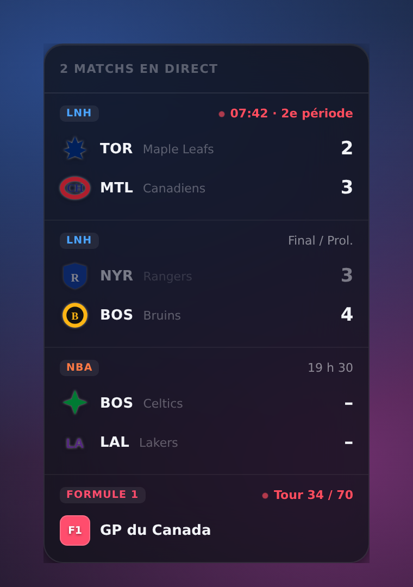

# Sports Counter

Widget flottant de scores sportifs en direct pour **Windows**.
Il reste au-dessus de toutes les fenêtres, se déplace à la souris, et affiche
seulement les équipes que tu choisis.



## Ce que ça fait

- **Toujours au-dessus** des autres fenêtres, sur tous les bureaux virtuels.
- **Déplaçable** : tu attrapes la barre du haut, la position est retenue au prochain lancement.
- **Impossible à perdre hors de l'écran** : le widget est ramené dans la zone
  visible s'il en dépasse, et ne passe jamais sous la barre des tâches.
- **Placé en bas à gauche** au premier lancement, juste au-dessus de la barre des tâches.
- **Activable / désactivable** : `Ctrl + Alt + S`, ou clic sur l'icône dans la zone de notification.
- **Logos des équipes** affichés à côté de chaque score.
- **Choix des équipes** dans une fenêtre de réglages, ligue par ligue.
- **Rafraîchissement adaptatif** : toutes les 25 s pendant un match, toutes les 5 min sinon.

## Ligues couvertes

LNH, NBA, NFL, MLB, Premier League, Ligue des champions, Formule 1.

Les données viennent de l'API publique d'ESPN : **aucun compte, aucune clé
d'API**. En contrepartie, c'est une API non officielle, qui peut changer sans
préavis.

## Obtenir l'app sans rien installer

C'est la voie recommandée. **Tu n'installes aucun outil de développement.**

1. Onglet **Actions** du dépôt → dernière exécution de « Compiler pour Windows »
2. Section **Artifacts** en bas → télécharger `Sports-Counter-Windows`
3. Décompresser, lancer l'installateur

GitHub compile l'app sur une vraie machine Windows, et la taille exacte des
fichiers produits s'affiche dans le résumé de chaque exécution.

Pour obtenir un lien de téléchargement permanent, pousse une étiquette :

```bash
git tag v0.1.0
git push origin v0.1.0
```

L'installateur apparaît alors dans les **Releases** du dépôt.

## Compiler soi-même (facultatif)

À ne faire que pour modifier le code et voir le résultat immédiatement.
Il faut alors installer, une seule fois :

1. **Rust** — https://rustup.rs
2. **Visual Studio Build Tools** avec la charge de travail « Développement Desktop en C++ »
3. **Node.js** — https://nodejs.org

```bash
npm install
npm run dev      # lance l'app en mode développement
npm run build    # produit l'installateur dans src-tauri/target/release/bundle/
```

> **Attention** : cet outillage occupe **3 à 6 Go**, et le dossier de
> compilation `src-tauri/target` encore **2 à 4 Go**. Ça ne concerne que la
> machine qui compile — l'app produite, elle, reste à quelques mégaoctets.
> Tu peux supprimer `src-tauri/target` à tout moment, il se régénère.
>
> Si tu ne veux pas de ça, utilise la GitHub Action ci-dessus : tu modifies le
> code, tu pousses, et tu récupères l'installateur compilé.

## Aperçu sans compiler

```bash
npm run preview
```

Rend le widget et l'écran de réglages dans Chromium avec des données de
démonstration, et enregistre les captures dans `tools/preview/`.
Tu peux aussi ouvrir `src/index.html?demo` via n'importe quel serveur local.

## Organisation du code

| Chemin | Rôle |
|---|---|
| `src/index.html`, `widget.js`, `widget.css` | le widget lui-même |
| `src/settings.html`, `settings.js`, `settings.css` | le choix des équipes et les options |
| `src/lib/api.js` | appels à ESPN et mise en forme des données |
| `src/lib/leagues.js` | catalogue des ligues |
| `src/lib/store.js` | préférences, dans `localStorage` |
| `src/lib/crest.js` | logo d'équipe, avec repli sur un monogramme coloré |
| `src-tauri/src/lib.rs` | fenêtre, zone de notification, raccourci global, relais réseau |
| `tools/` | génération des icônes et des aperçus |

Les requêtes réseau passent par Rust (commande `espn_get`) plutôt que par la
page web : ça évite les blocages CORS, et le domaine appelé est fixé dans le
code, donc l'interface ne peut pas rediriger les appels ailleurs.

## Réglages disponibles

- Équipes suivies, par ligue
- Mode compact (masque les noms d'équipes)
- Nombre de matchs affichés (1 à 10)
- Opacité du widget
- Masquage automatique des matchs terminés depuis plus de 6 h

## Retrouver le widget quand il a disparu

Windows range souvent les nouvelles icônes de la zone de notification derrière
la petite flèche `^`, à côté de l'horloge. Trois façons de rappeler le widget :

1. **`Ctrl + Alt + S`**
2. **Relancer l'app** depuis le menu Démarrer : elle ne s'ouvre pas en double,
   elle réaffiche le widget
3. Bouton **« Afficher le widget »** dans la fenêtre de réglages

Pour épingler l'icône à côté de l'horloge : *Paramètres → Personnalisation →
Barre des tâches → Autres icônes de la barre d'état système*.

## Limites connues

- L'API ESPN n'est pas officielle : si ESPN change son format, il faudra adapter
  `src/lib/api.js`.
- La Formule 1 n'a pas de suivi tour par tour : le widget affiche la course en
  cours ou la prochaine, sans classement en direct.
- Le chiffrement des connexions passe par Schannel, le composant TLS de
  Windows, plutôt que par une bibliothèque embarquée. L'app est plus légère,
  mais elle suit le magasin de certificats du système.
